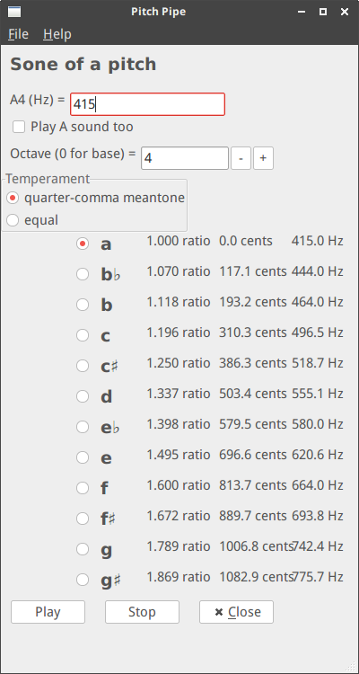

# Sone of a pitch 

A simple app that plays tones from a scale according to a given temperament. The idea is that the computer can play a drone for you which you can then play your instrument to in order to tune it.




## Requirements
`python` v.3, `wxpython`, `numpy`, `pyaudio`

## Usage
Simply run 
```
make
``` 


### Notescript
There is also an interface where you can write a little score using a tedious format and then have the program generate a wave file.

See various examples in `examples`.

e.g.

```
python3 notescript.py examples/ariodante1.txt
```


# TODO
Lots and lots!

* [ ] Allow alternative pitch notations (cis / des)
